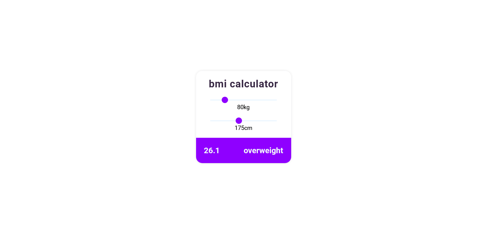

# bmi calculator app
bmi calculator written in vanilla js
### [Go Live](https://tadrochlinski.github.io/bmi-calculator/)

## Overview
User is able to 
- enter his weight and height with range sliders
- check his bmi and weight class

### Screenshot

### Built with

- HTML
- CSS / SCSS
- Flex
- VanillaJS
- localStorage